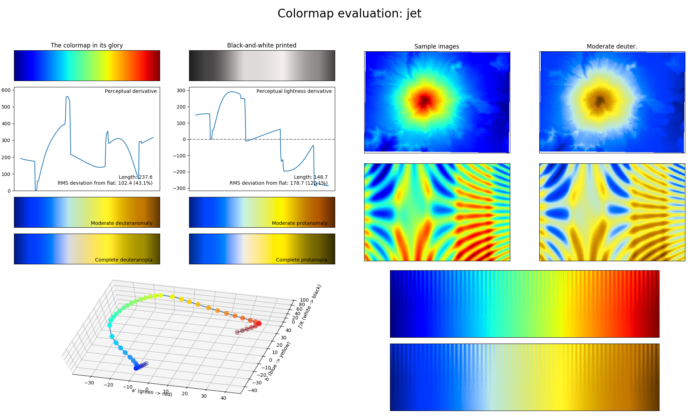
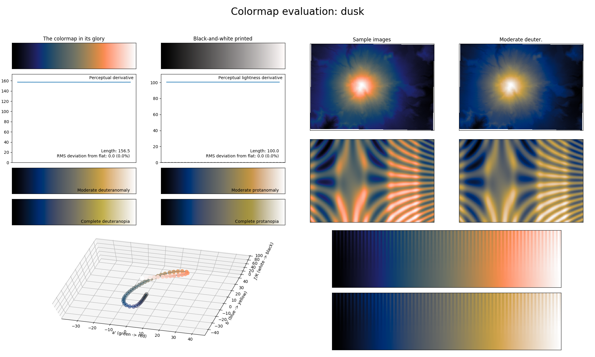
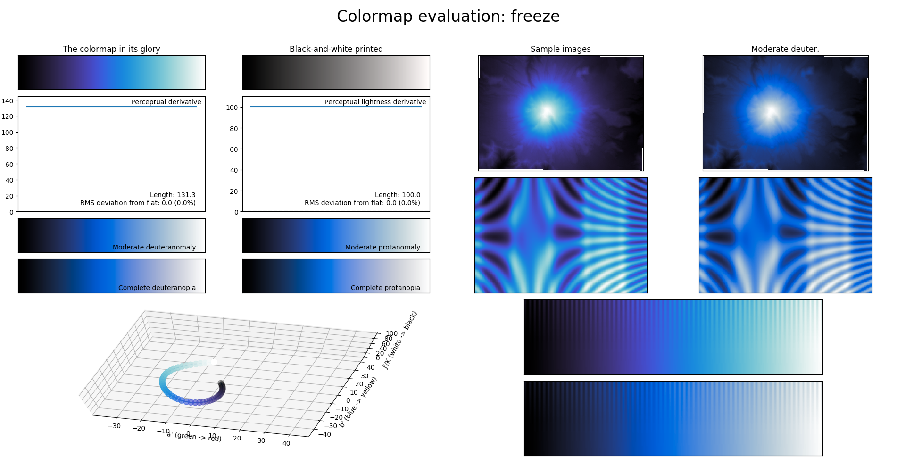
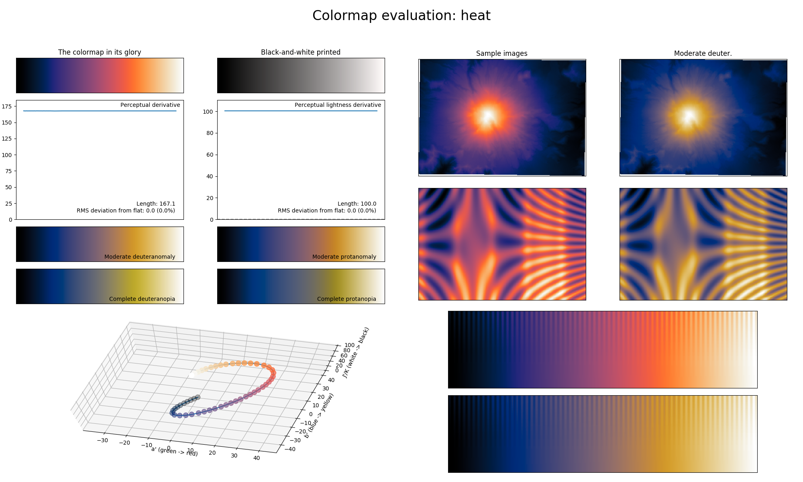
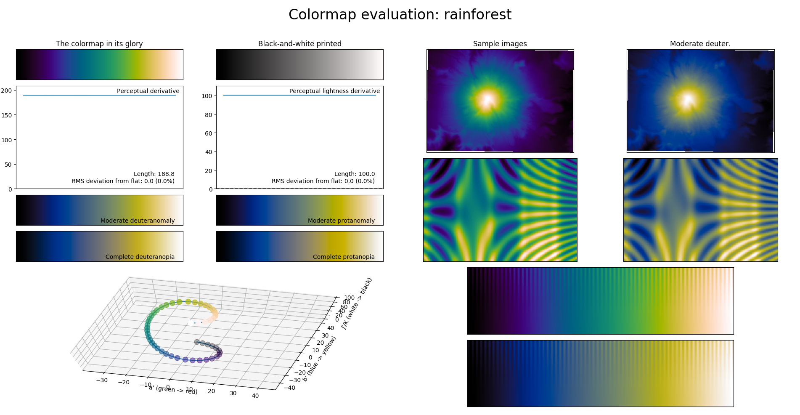
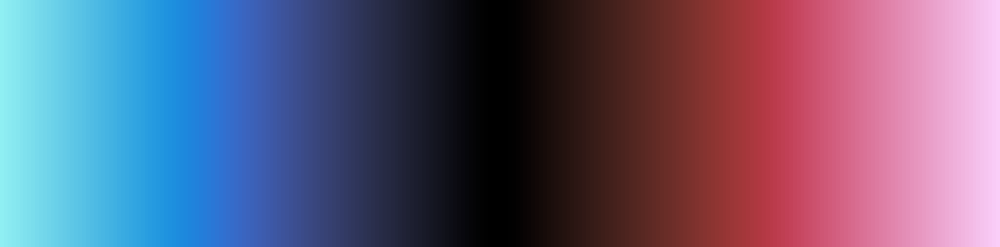
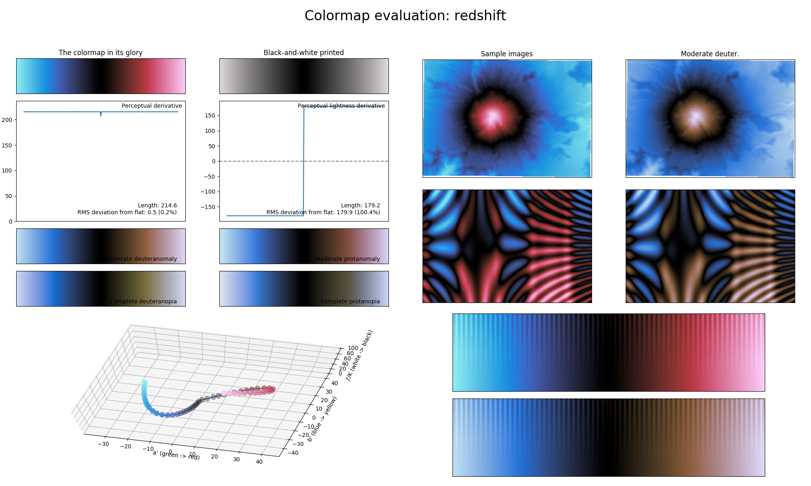

.. _colormaps:

Colormaps
=========
The *e13Tools* package provides a collection of scientific colormaps to be used by different *Python* packages and projects, mainly `matplotlib`_ (see `here <https://matplotlib.org/3.1.0/tutorials/colors/colormaps.html>`_ for an overview of all their colormaps as of v3.1.0).
All colormaps presented here were made using the `viscm`_ package and an overview of them can be found in `Descriptions`_ below.

These colormaps can be made available through *matplotlib* by simply importing *e13Tools* (which automatically executes the :func:`~e13tools.pyplot.import_cmaps` function on the ``e13tools/colormaps`` directory).
So, for example, if one were to use the *rainforest* colormap, this could be done with::

    # Import e13Tools to register colormaps
    import e13tools as e13

    # Import packages for plotting
    from matplotlib import cm
    import matplotlib.pyplot as plt
    import numpy as np

    # Access rainforest colormap
    cmap = cm.rainforest

    # Generate some data to plot
    x = np.random.rand(100)
    y = np.random.rand(100)
    z = x**2+y**2

    # Make scatter plot of data with colormap
    plt.scatter(x, y, c=z, cmap=cmap, s=300)
    plt.show()

Accessing the colormaps in other packages than *matplotlib* would require reading in the text-files in the ``e13tools/colormaps`` directory, which contain the normalized RGB values of every colormap, and registering them in the package manually.

Background
----------
A good scientific colormap is often described/characterized as *perceptually uniform sequential*, which means that it is perceived as uniformly changing in lightness and saturation, mostly at the same hue.
This allows for the data values of a plot or image to be interpreted correctly by the viewer without giving false information (a great example of this can be found `here <https://mycarta.wordpress.com/2012/10/14/the-rainbow-is-deadlong-live-the-rainbow-part-4-cie-lab-heated-body/>`_), which could potentially even be dangerous.
It also often allows for a plot using a colormap to be converted properly to grey-scale without losing information.
Basically, when viewing a plot or image that uses color-coded values, it should be possible to infer how every color relates in terms of value to every other color, by simply looking at it (so, a legend or colorbar should NOT be necessary for this task).

Although this may sound easy enough, there are many colormaps out there that do this incorrectly.
The main problem usually is that humans do not perceive every color equally (for example, small variations in the color green are not perceived as it is such a natural color, while small variations in the colors red and blue are perceived).
Therefore, if one were to make a colormap that linearly increases in color wavelength, it would not be perceived as uniformly changing at all.
A good example of this is a colormap that is very commonly used in many different applications, the *jet* colormap:

    Output of the *viscm* package showing the statistics and performance of the *jet* colormap.
    The various different plots show how the colormap changes in lightness and perceived color, as well as how well the colormap converts to different types of color-vision deficiency (color blindness) and grey-scale.
    In case of a perceptually uniform sequential colormap, the two derivative plots should show a straight horizontal line; the colorspace diagram should be smooth; and the lines in the right-bottom corner plots should be visible up to the same depth across the entire colormap.

In :numref:`jet_viscm`, one can view the statistics output of the *jet* colormap, made with the `viscm`_ package.
As you can probably see, the *jet* colormap shows the spectrum of visible light, which trivially increases linearly in wavelength.
However, we can clearly see that this introduces multiple problems, as the color green for example is perceived as the brightest of the visible colors due to its very natural occurance.
This is an example of a colormap where it would be necessary to have a colorbar/legend, and it is overall a bad colormap to use.

These days, researchers are becoming more and more aware of what colormaps to use and what not, and of the fact that no single colormap can be used in all situations.
However, as there are still many more bad colormaps out there than good ones, it is going to take quite some time before they will disappear completely. 
For this reason, on this page, the different colormaps in *e13Tools* are introduced and described what they should be used for, such that others can use them properly for their own projects.

.. _matplotlib: https://github.com/matplotlib/matplotlib
.. _viscm: https://github.com/matplotlib/viscm
.. _PRISM: https://github.com/1313e/PRISM

Descriptions
------------
Sequential
++++++++++
Sequential colormaps (that are perceptually uniform of course) are basic colormaps that start at a reasonably low lightness value and uniformly increase to a higher value.
They are commonly used to represent information that is ordered.
The *matplotlib* package already has a few great sequential colormaps readily available for the user, mainly the colormaps named *viridis*; *plasma*; *inferno*; *magma*; and *cividis*.
However, three of these colormaps use the color red as its main color and none of them uses the full lightness range.
As it might sometimes be desirable to use a different main color or maximize the perceptual range of the colormap, *e13Tools* provides a few sequential colormaps that do exactly that.
These colormaps are shown below.

Dusk
####

The *dusk* colormap is a visual representation of what the sky looks like during dusk (with the black/blue representing the dark sky and the red/white the last few sunrays above the horizon).
It covers the full lightness range and has the colors blue and orange as its main colors.
It features a greyish area in the middle, making it great for representing ordered information where the extremes should be the main focus of the image.

Freeze
######

The *freeze* colormap is one of the two main colormaps used in `PRISM`_, and is a visual representation of a large body of water freezing over.
It covers the full lightness range and solely uses the color blue.
As it only uses a single color, this colormap is excellent for representing information that varies smoothly, like density/intensity values in a scientific plot.

Heat
####

The *heat* colormap is an equivalent to how temperature differences are often shown on thermal cameras.
It covers the full lightness range and mainly uses the colors blue/purple and orange.
It should mainly be used for representing information where the center values are important.

Rainforest
##########

The *rainforest* colormap is one of the two main colormaps used in `PRISM`_, and is a visual representation of Mother Nature, in particular a dense rainforest (with blue representing the water; green the trees/plants; and yellow/red the Sun).
It covers the full lightness range and uses all major colors (as it was created by an attempt to improve the *jet* colormap).
Because it uses all major colors, this colormap is excellent for representing information where small adjacent differences should be clearly visible.
This also makes *rainforest* a good standard colormap choice as it treats all information as equally important.

Diverging
+++++++++
A different category or class of colormaps, is the group of *diverging* colormaps.
Unlike sequential colormaps, diverging colormaps start at their lowest (or highest) lightness value at both ends and monotonically increase (decrease) to the highest (lowest) lightness value in the center.
This makes them very useful to represent information that has a critical middle value or when data deviates around a common center (usually zero), like topographical maps.
The *matplotlib* package has quite a few diverging colormaps, but none of them starts and ends at the same lightness value; and most do not change perceptually uniform.
Therefore, a few alternatives are introduced here.

Redshift
########

The *redshift* colormap is a visual representation of the (mostly) astronomical phenomenon with the same name, where electromagnetic radiation (such as light) undergoes an increase in wavelength.
It covers almost the full lightness range (i.e., :math:`[0, 90]`) and uses red and blue as its main colors.
It is special in that, unlike most other diverging colormaps, it reaches its lowest lightness value in the center and increases in lightness towards the ends.
This makes it ideal for representing information where the deviation from the common center should be highlighted or when plotting data values where the sign of a value is used as an indicator, like in a radial velocity or rotation measure map (where the sign is an indicator of direction).

